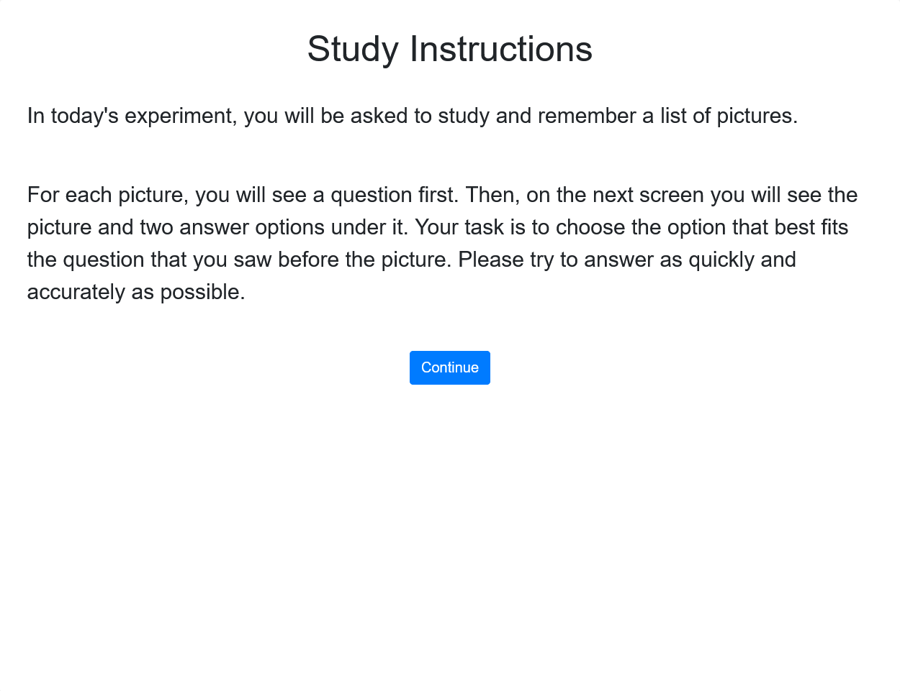
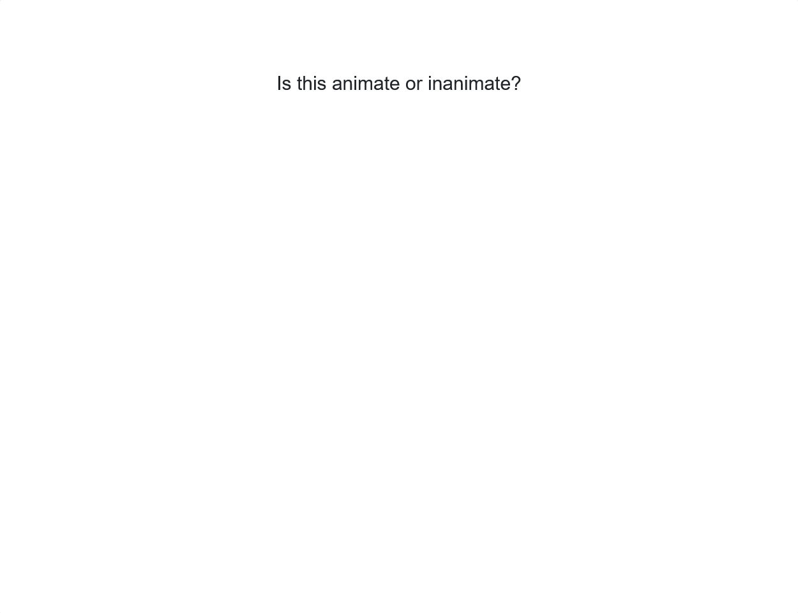

# starter task

Create an simple experiment based on https://github.com/PCLLAB/LoP-Effect.

Kyle available for help and questions

Please use all tools and resources available

## Initialize experiment

Basically copy the files and structure from `LoP-Effect/E1`.

- `Materials` holds things like images and json files containing instructions and question/answers. We will only be using the `Practice.json` and pictures in the `Practice` folder for this experiment to keep it short.
- `css` holds css. Mostly unused, but impossible to delete.
- `js` holds js libraries. You may notice an ancient version of jquery and bootstrap 🤮.
- `plugins` contains jsPsych plugins
- `experiment.html` is where everything starts. It uses all the js and css files and starts the experiment.
- `experiment.js` is where the logic is defined. This is 99% of what you will need to edit.
- `jspsych.js` is the star of the show. Important to notice, this is jspsych v5.
- `lab-start.html` and `verify.html` are used to manually set experiment conditions/parameters. You start at `lab-start.html` which directs to `verify.html` which directs to `experiment.html` with the chosen URL parameters.

`experiment.js` is the basically the only file you will need to edit.

## Running an experiment locally

Serve it however you want, it's just a website. If you have `npm`, you can run the following commands.

```sh
npx http-server -c-1
# `-c-1` disables caching, see https://github.com/http-party/http-server
```

Access the website via the link in your terminal. You will usually need to go to `/experiment.html` to see the experiment or `/lab-start.html` if the experiment requires certain parameters.

`LoP-Effect` has a parameter `Version` so the final url is something like `/experiment.html?Version=1`

## Experiment details

You should have all the same files as `LoP-Effect/E1` in your folder. You can delete everything in your `experiment.js` and add stuff one by one to see how it work.

Here is a stripped down example.

```js
const files = {
  arbitraryName: "path to JSON file",
};

class Experiment {
  constructor() {
    this.timeline = [];

    //calls this.loadMaterials()
  }

  loadMaterials() {
    // loads JSON files and makes them available as fields
    //
    // calls this.buildTimeline() and this.run()
  }

  buildTimeline() {
    const instructionTrial = {
      type: "pcllab-core",
      stimuli: [this.arbitraryName["field in json file"]],
      show_button: true,
      button_text: "Continue",
      response_count: 0,
      minimum_time: 7000,
    };

    this.timeline.push(instructionTrial);
  }

  run() {
    // start jsPsych with the built timeline
    //
    // once finished, sends a post request with experiment data to store in backend
    //
    // EACH EXPERIMENT HAS A UNIQUE URL TO POST DATA TO, CREATE ONE IN JARVIS
  }
}
```

You can strip out anything related to URL paramters, versions, conditons. There is just one version for this task.

There should be an instruction trial first.


Your experiment should use `"Materials/Practice.json"` instead of the `"Materials/Order1.json"` and do basically the same thing, show a question, followed by the image and two buttons to respond for each item.




After, the data should be sent to and visible in https://jarvis.psych.purdue.edu/

- Create a new "experiment" using the + icon and use the new data collection URL instead of the URL already in "LoP-Effect". This is important because we want to save the data generated at the end of your "experiment" in a separate place from the actual experimental data that was already collected. You can name the new experiment "Programmer Starter Task_Lastname". After creating a new experiment on Jarvis, you will see a button that says "generate". From there you will be able to see the experiment ID and an URL. You will replace the ID in the saveData() function, and replace the URL in the run() function at the end of the experiment.

